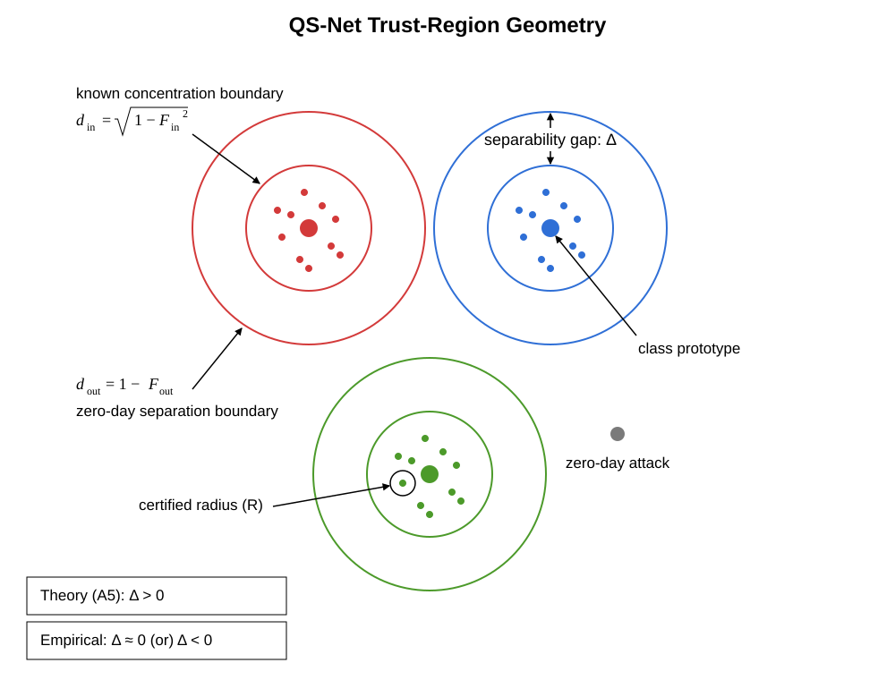
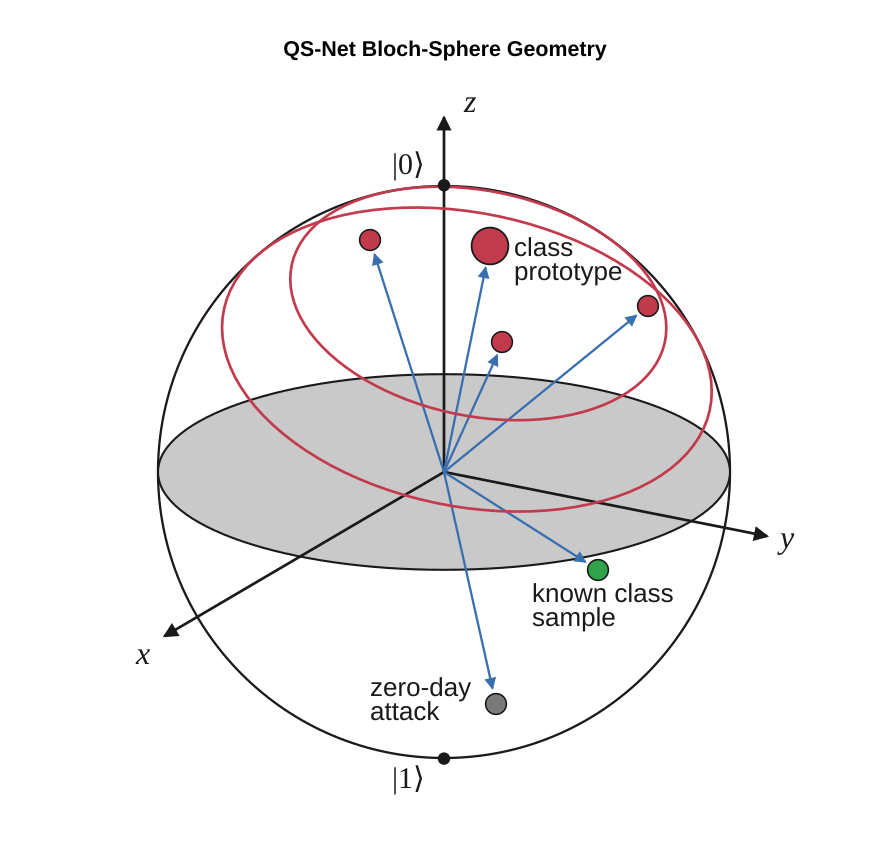

# quantum-sentinel

| 2D | 3D |
|:---:|:---:|
|  |  |

This project applies quantum machine learning to Cyber IoT datasets using the QS-Net architecture. QS-Net combines three stages:

1. **Algorithm 1 (MAQT)**: Trains the variational circuit by minimizing cross-entropy plus intra- and inter-class prototype losses, shaping class geometry in Hilbert space.
2. **Algorithm 2 (CQ-ZDR)**: Calibrates a conformal zero-day rejection threshold from known-class calibration data.
3. **Algorithm 3 (Inference)**: Classifies known traffic within a certified radius, or flags samples as `ZERO_DAY` when they fall outside that bound.

Together, these stages yield a hybrid quantum–classical pipeline that learns known attack patterns and detects unseen (zero-day) threats with statistical guarantees.

## Datasets

**Notes**: Specific preprocessing modifications have been applied to the original datasets.

### Used

- [CIC IoT 2023 (Canadian Institute for Cybersecurity)](https://www.kaggle.com/datasets/himadri07/ciciot2023)
- [BoT IoT](https://research.unsw.edu.au/projects/bot-iot-dataset)
- [UNSW-NB15](https://research.unsw.edu.au/projects/unsw-nb15-dataset)

### Discarded

- [Edge-IIoTset (Ferrag et al., IEEE Access 2022)](https://www.kaggle.com/datasets/mohamedamineferrag/edgeiiotset-cyber-security-dataset-of-iot-iiot)
- [TON IoT (UNSW Canberra)](https://www.kaggle.com/datasets/arnobbhowmik/ton-iot-network-dataset)

## File Structure

```
/
├── ...
├── img/
├── documents/
├── data/
├── team-artifacts/
│   ├── ...
│   └── arjun/
├── artifacts/
├── logs/
│
├── legacy_scripts/
├── legacy_notebooks/   # see LEGACY_NBS.md for expanded details
│
├── scripts/
├── BoT-IoT experiments/
│   ├── 3class-3000each-lr0.05-{maqt,algo3}.ipynb
│   ├── 4class-3000each-lr0.05-{maqt,algo3}.ipynb
│   ├── 4class-3000each-lr0.01auto-{maqt,algo3,algo3-cached}.ipynb
│   ├── 4class-3000each-lr0.01auto-lambda2-{maqt,algo3-cached}.ipynb
│   ├── 4class-3000each-lr0.01auto-newlambdas-{maqt,algo3-cached}.ipynb
│   ├── 4class-10000each-lr0.0005-{maqt,algo3}.ipynb
│   ├── 4class-20000each-lr0.05-{maqt,algo3}.ipynb
│   ├── 4class-20000each-lr0.01auto-lambda2-{maqt,algo3-cached}.ipynb
│   └── 4class-all-lr0.01auto-lambda2-{maqt,algo3-cached}.ipynb
│
│   =========================================
│   *** ALL DAILY DELIVERABLES START HERE ***
│   =========================================
├── 01.setup-guide.md                   # day 1 deliverable
├── 02.encoding-data-iris.ipynb         # day 2 deliverable
├── 03.training-iris.ipynb              # day 3 deliverable
│
├── final_notebooks/                    # day (4-9, 14) deliverables ## NEW NOTEBOOKS
│   ├── final-bot-iot-{maqt,vqc}-train.ipynb    ## REAL: MAQT, VQC Training     ## BoT-IoT
│   ├── final-ciciot2023-{maqt,vqc}-train.ipynb ## REAL: MAQT, VQC Training     ## CICIoT2023
│   └── final-unsw-nb15-{maqt,vqc}-train.ipynb  ## REAL: MAQT, VQC Training     ## UNSW-NB15
│
├── 10.maqt-loss-unit-test-iris.ipynb                   # day 10 deliverable
├── 11.hilbert-geometry-diagnostics_v2-bot-iot.ipynb    # day 11 deliverable    ## cap(50) train BoT-IoT
├── 11.hilbert-geometry-diagnostics_v2-ciciot2023.ipynb # day 11 deliverable    ## cap(50) train CICIoT2023
├── 11.hilbert-geometry-diagnostics_v2-unsw-nb15.ipynb  # day 11 deliverable    ## cap(50) train UNSW-NB15
├── 12,19.fgsm-pgd-bot-iot.ipynb                # day 12, 19 deliverables       ## 300 known-accepted test BoT-IoT
├── 12,19.fgsm-pgd-ciciot2023.ipynb             # day 12, 19 deliverables       ## 300 known-accepted test CICIoT2023
├── 12,19.fgsm-pgd-unsw-nb15.ipynb              # day 12, 19 deliverables       ## 300 known-accepted test UNSW-NB15
├── 13.tune-lambdas-bot-iot.ipynb               # day 13 deliverable ## DPP cap(3000), ~10000 train BoT-IoT
├── 13.tune-lambdas-ciciot2023.ipynb            # day 13 deliverable ## DPP cap(500), ~10000 train CICIoT2023
├── 13.tune-lambdas-unsw-nb15.ipynb             # day 13 deliverable ## DPP cap(1000), ~5600 train UNSW-NB15
├── 15.depolarizing-channel.ipynb               # day 15 deliverable ## NO DATASET
│
├── final_notebooks/                            # day (15-29) deliverables
│   ├── the-final-bot-iot-{maqt,vqc}-results.ipynb
│   ├── the-final-ciciot2023-{maqt,vqc}-results-{part1,part2}.ipynb
│   ├── the-final-unsw-nb15-{maqt,vqc}-results.ipynb
│   │
│   ├── final-bot-iot-algo3-cached ({maqt,vqc}).ipynb       # REAL: Full Algo.3 Pipeline
│   ├── final-ciciot2023-algo3-cached ({maqt,vqc}).ipynb    # REAL: Full Algo.3 Pipeline
│   └── final-unsw-nb15-algo3-cached ({maqt,vqc}).ipynb     # REAL: Full Algo.3 Pipeline
│   =======================================
│   *** ALL DAILY DELIVERABLES END HERE ***
│   =======================================
│
└── eda.ipynb
```

---

## Days with Missing Deliverables

- Day 26 (partial): MAQT ablation
- Day 30
- Day 31
- Day 32

## Optional To-Dos

- Improve accuracies: retrain MAQT, VQC models
- Experiment with Hinge-Loss: use *legacy_scripts/v2.4_suggestions/loss.py* > `inter_loss_term()`
- Re-organize daily deliverables

---

## Tech Stack

`PennyLane`, `PyTorch`, `NumPy`, `Pandas`, `Scikit-learn`

## License

See [LICENSE](LICENSE)