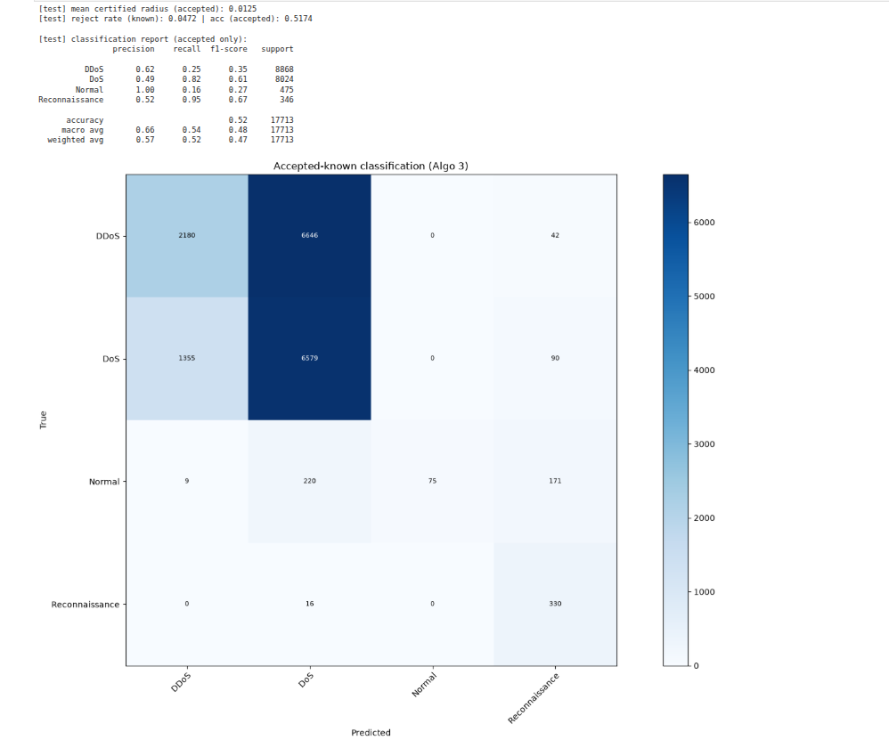
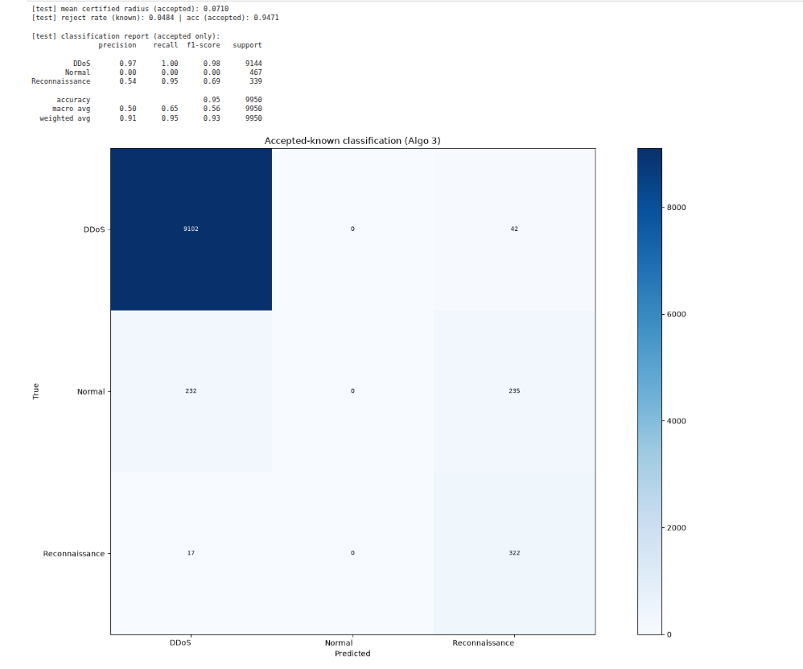
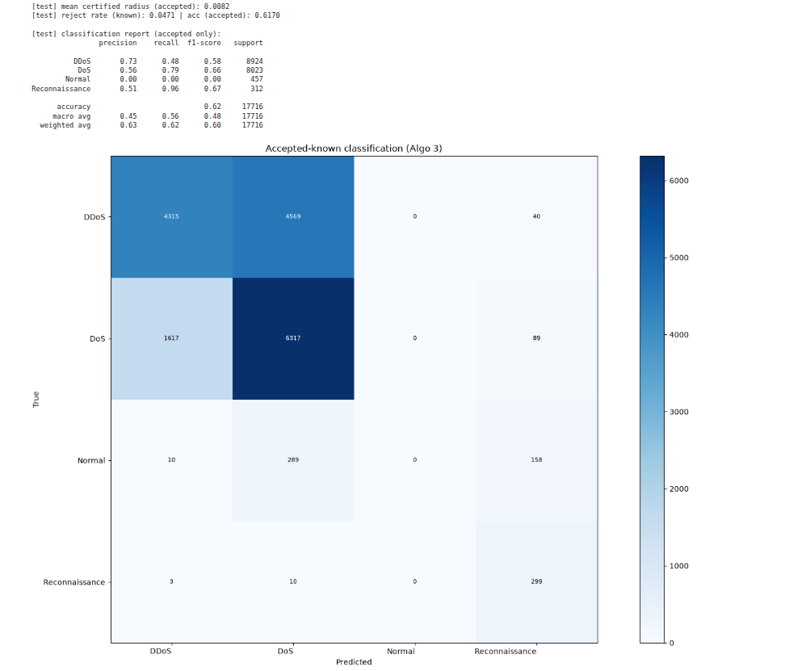
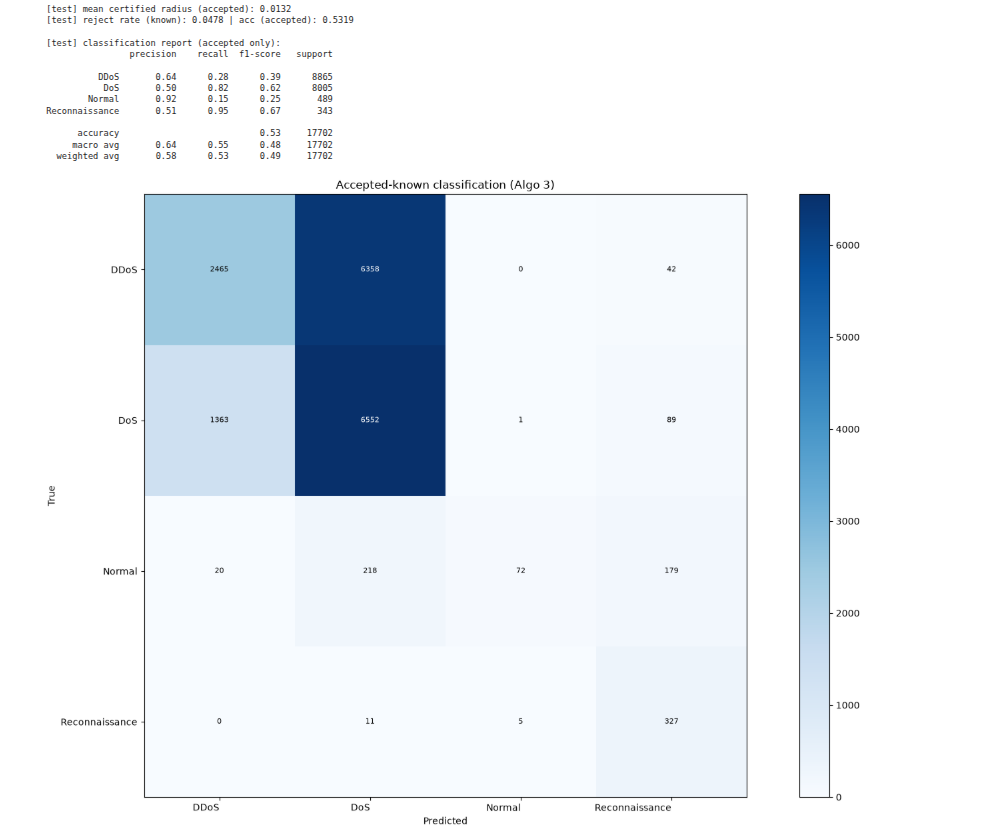
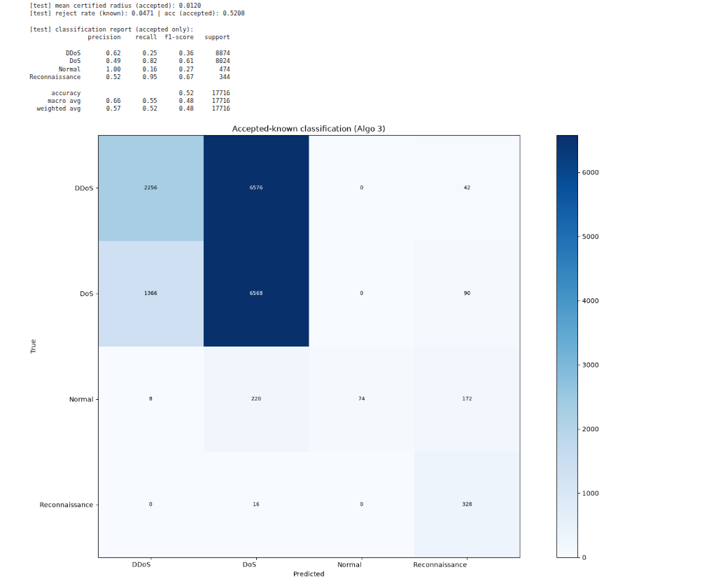
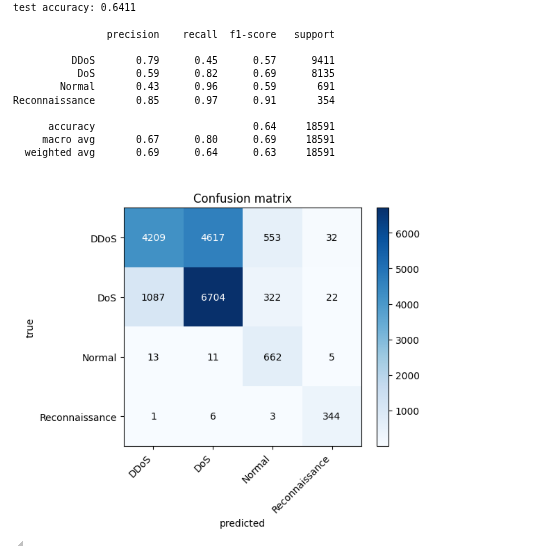
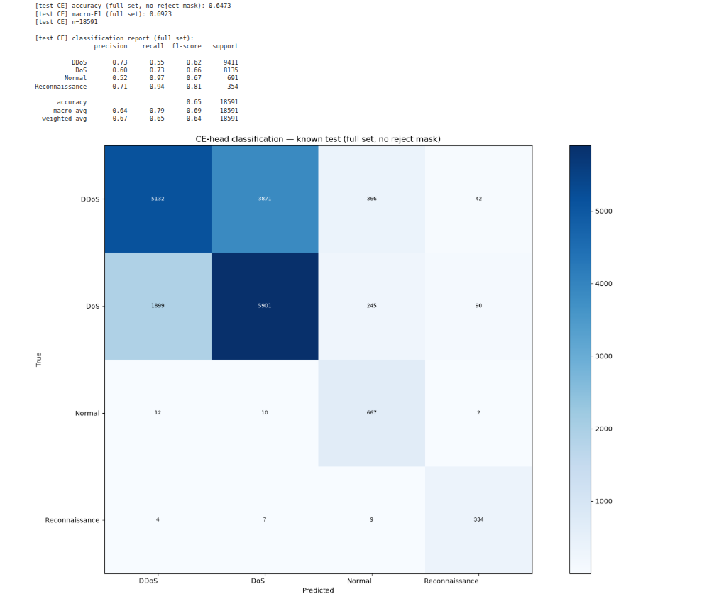

# BoT-IoT MAQT Training Setups

This note summarizes how **lawun** chose MAQT training settings on FROZEN BoT-IoT, and how those runs compare to **arjun**’s reported CE-head test accuracy.

Unless stated otherwise, confusion matrices below are **Algo-3 accepted-known test** results: known-class test rows with nonconformity $s(x) \le q$ (Global conformal). Rejected known-test rows are excluded from accuracy and from the matrix.

---

## 1. Baseline: 4-class, 3000 / class, fixed LR \(0.05\)

**Setup:** four known classes (DDoS, DoS, Normal, Reconnaissance); DPP coreset capped at **3000 per class**; fixed learning rate **\(0.05\)**.

**Observation:** overall accepted accuracy is modest (~52%). **Normal** is poorly recovered (high precision, very low recall). **DDoS** and **DoS** are heavily confused.



---

## 2. Ablation: drop DoS (3-class), same budget

**Hypothesis:** majority DoS / DDoS traffic might be starving **Normal**.

**Setup:** train without **DoS** (DDoS + Normal + Reconnaissance only); still **3000 / class**, LR **\(0.05\)**.

**Observation:** **Normal** does **not** improve (accepted Normal recall stays at zero in this run). High headline accuracy is driven by DDoS dominance, not better Normal geometry.

**Conclusion:** DoS presence is not the main cause of poor Normal prediction $\rightarrow$ return to **4-class**.



---

## 3. Scale data: 4-class, 20000 / class, LR \(0.05\)

**Setup:** larger DPP coreset (**20000 per class**), same fixed LR **\(0.05\)**.

**Observation:** accepted accuracy rises (~62% vs ~52% at 3000). **DDoS ↔ DoS** confusion remains large; **Normal** stays weak (near-zero correct in this matrix). More data helps overall accuracy but does not fix class separation.



---

## 4. Smaller fixed LR, moderate size: 10000 / class, LR \(0.0005\)

**Setup:** **10000 per class**, fixed LR **\(0.0005\)**.

**Observation:** accepted accuracy (~53%) is close to the 3000 / LR \(0.05\) baseline (only a small bump, on the order of ~1Auto LR percentage point in this comparison). **DDoS ↔ DoS** and weak **Normal** persist. Extra samples + tiny fixed LR do not justify the cost for this pipeline.



---

## 5. Back to 3000 / class with cosine LR schedule

Given diminishing returns from larger coresets under fixed LR, lawun returns to **3000 per class** and turns on **automatic LR decay** (`use_lr_schedule=True`, cosine annealing from the starting LR toward a small floor).

### 5a. Start LR \(0.03\)


### 5b. Start LR \(0.01\) (chosen)



**Observation:** accepted metrics for start \(0.03\) vs \(0.01\) are similar (~52%). Training with start **\(0.01\)** is judged smoother on the loss/LR curves, so the working choice is:

| Knob | Choice |
|------|--------|
| Classes | 4 (DDoS, DoS, Normal, Reconnaissance) |
| Train coreset | 3000 / class (DPP) |
| LR | cosine schedule, start **\(0.01\)** |
| Notebooks | `4class-3000each-lr0.01auto-maqt` $\rightarrow$ `4class-3000each-lr0.01auto-algo3` (+ cached variants) |

---

## 6. Fair compare to arjun (full known test, no reject mask)

Algo-3 accepted-only accuracy is **not** comparable to a CE-head score on **every** known-test row.

- **arjun** (`ablation-test-bot-iot`): CE-head `predict_labels` on full known test $\rightarrow$ about **64%** accuracy (\(n = 18591\)).
- **lawun** best MAQT (4-class, 3000 / class, cosine start \(0.01\)): CE-head on the **same full known test**, no conformal mask $\rightarrow$ about **65%** accuracy (\(n = 18591\)).

| arjun (~64%, full known test, CE, no reject) | lawun (~65%, full known test, CE, no reject) |
|:---:|:---:|
|  |  |

Under that matched protocol, lawun’s selected run is on par with (slightly above) arjun’s reported CE full-test accuracy. Remaining open issue for both setups: **DDoS vs DoS** separation; conformal accepted-only CMs still show weak **Normal** recall when rejects are stripped out.

---

## Decision trail (short)

```text
4c / 3k / lr=0.05
  $\rightarrow$ Normal weak, DDoS↔DoS confused
3c (drop DoS) / 3k / lr=0.05
  $\rightarrow$ Normal still not fixed $\rightarrow$ back to 4c
4c / 20k / lr=0.05
  $\rightarrow$ accuracy up; DDoS↔DoS / Normal still hard
4c / 10k / lr=0.0005
  $\rightarrow$ ≈ 3k result; not worth the extra data for this goal
4c / 3k / cosine 0.03 vs 0.01
  $\rightarrow$ similar accepted metrics; prefer 0.01 (smoother)
selected: 4c / 3k / cosine start 0.01
fair CE full-test vs arjun: ~65% vs ~64%
```
